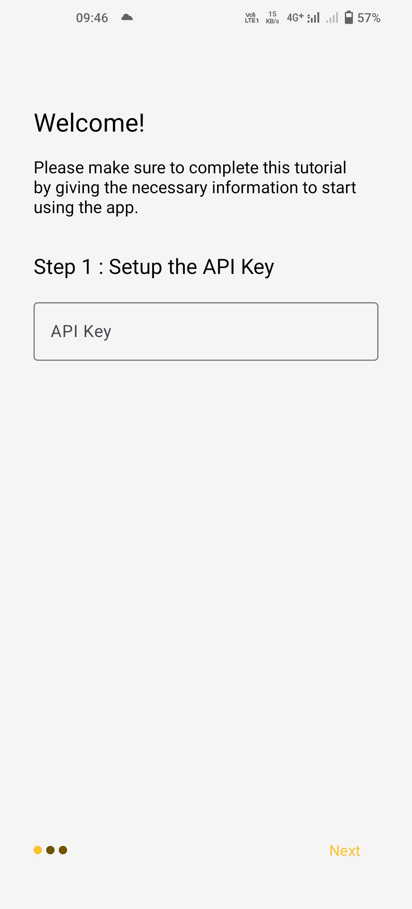
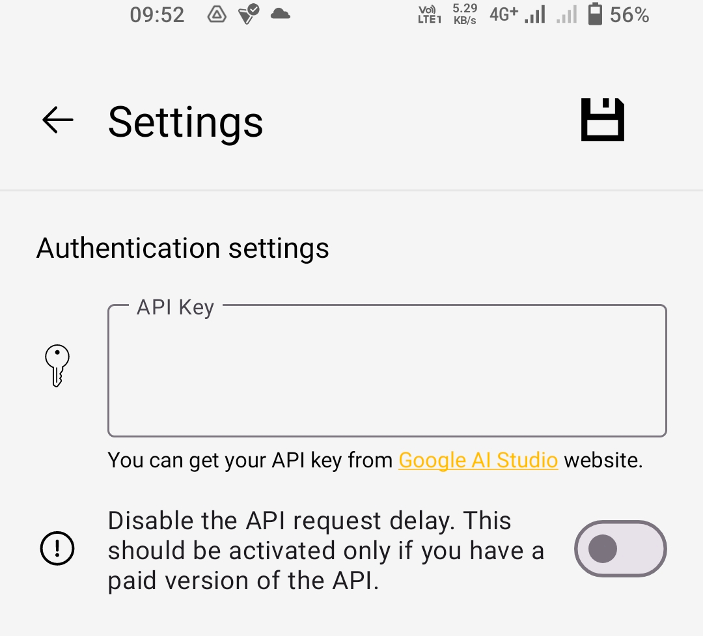

# DoCamp - Brings RAG to mobile


## Introduction

DoCamp is an Android application created to participate in the Gemini API developer competition. The name "DoCamp" is a combination of the words "Doc" and "Camp," suggesting that this app serves as a place to interact and chat with documents.

## Purpose

This application was developed to fill a gap in the mobile app ecosystem, where Retrieval Augmented Generation (RAG) apps are not as prevalent as they are on web or desktop platforms. With DoCamp, users can upload and work with `.txt` and `.pdf` files.

## Features

### Text Extraction

For `.txt` files, DoCamp uses native Java functionality for text extraction. However, for `.pdf` files, the app utilizes the `Apache PDFBox` library.

### Vector Database

RAG applications rely on vector databases, and DoCamp incorporates a simple vector database implementation. The text from the uploaded files is divided into multiple chunks, and each chunk is stored as an embedding in the database. To embed the chunks, the app leverages the Gemini API's Rest API option, as the Java API does not provide direct access to embedding models.

### Asynchronous Processing

DoCamp heavily utilizes CompletableFutures to handle long-running tasks in the background. This was a new concept for me and presented some challenges during the development process.

## Setup and Usage

To use the DoCamp application, follow these steps:

1. Create an API Key [here](https://aistudio.google.com/app/apikey).
2. Choose one of the following options to provide the API Key:

   - **Option 1:** Put the API Key directly in the code by modifying the `BuildConfig` class:

     ```java
     public class BuildConfig {
         ...
         public static final String apiKey = ""; // Enter your API Key here
     }
     ```

     Then uncomment these lines of code in the `WelcomeScreenActivity` class to skip the welcome screen activity.

     ```java
             // For debug purposes
     // TODO: Remove this code
     //        SharedPreferences.Editor editor1 = sharedPreferences.edit();
     //        editor1.putBoolean("tutorialDone", false);
     //        editor1.apply();
             // For debug purposes
     ```

   - **Option 2:** Install the app and provide the API Key in the welcome page.

     

3. If you are paying for the API Key, make sure to disable the API Key delay in the settings.

   

4. Ensure that you can use the Gemini API in your country. More details can be found [here](https://ai.google.dev/gemini-api/docs/available-regions).
5. Enjoy using the app! 😉

## Known Issues

Please note that when asking Gemini a question, you might encounter an error due to a problem with the API Key called "the recitation problem," which is an issue with the API.

## Contributing

If you find any bugs or issues, please open an issue on the project's repository, and the developer will address them if time permits.
